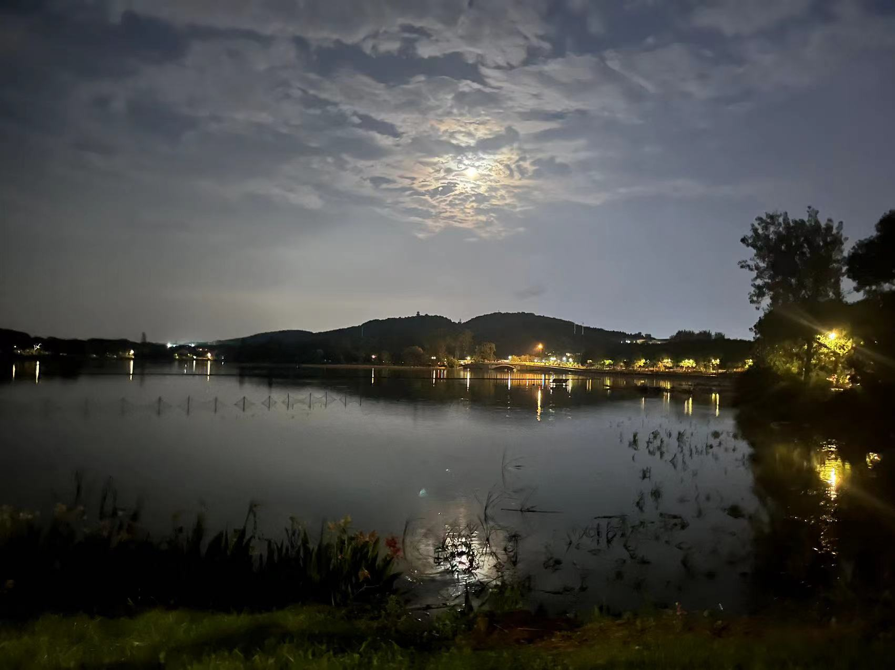
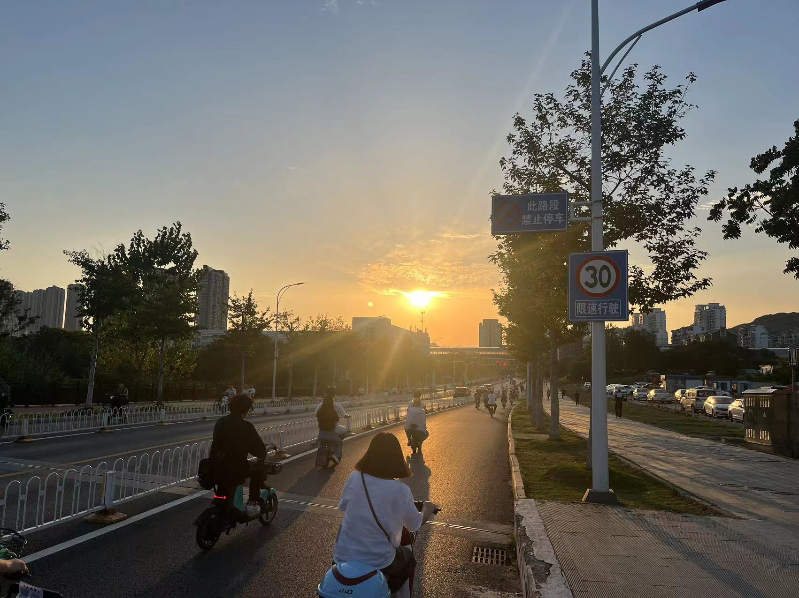

---
title: 随感
author: Alex
date: 2023-9-06
category: misc
layout: post
--- 

心中的失落，像是飞鸟从湖水上划过，又消失了

但偶尔也有充实，像雨水落到湖面，再荡开

晚安喵

my life is back on track

maybe

on a rainly night like this, deep into the night at almost 11pm, i'm still sitting in front of my laptop. i'm not sleepy at all, partly because i've slept for 3 hours after soccer at noon.

partly because the loneliness i immersed myself in.

loneliness is all around me, and i think i'm gonna write something. i've changed a lot since entering college, and i'm not sure if it's for the better or for the worse. 

for example, i write and read less. i used to read much english books, not to mention chinese ones. but now i seldom read. i even lost interest in tv series and films. often i just staring at the streaming information on my phone all day, or watch soccer or nba games. how pathetc. and i used to write much. i came across my notebook of senior high days. there are a few short stories and poems, i dare say some ideas in it is fairly good. but now i hardly write anything except for technical blogs. and my english is poorer now.

it's kinda strange that in the most stressful senior high days, i'm the most artistic. it's a way to escape that reality, i guess. now i can treat myself to almost any kind of entertainment, but i'm almost numb to them. i'm often bored.

but i'm not saying that i want to go back to senior high. i guess almost everyone experiencing entrance exam in china will agree it's horrible. what i mean is that i have, have to find something i really, really like to do. and i wish i can get along with my hope for myself, which is a kind of ill desire that dirves my to do something i don't like to do in order to achieve what we call success.

how pathetic.